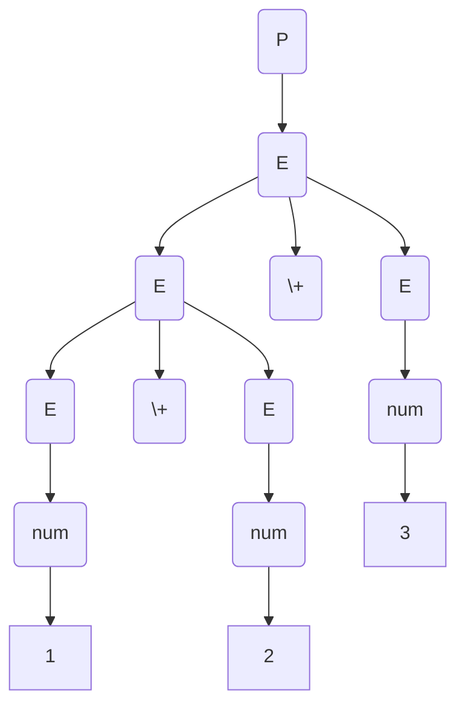
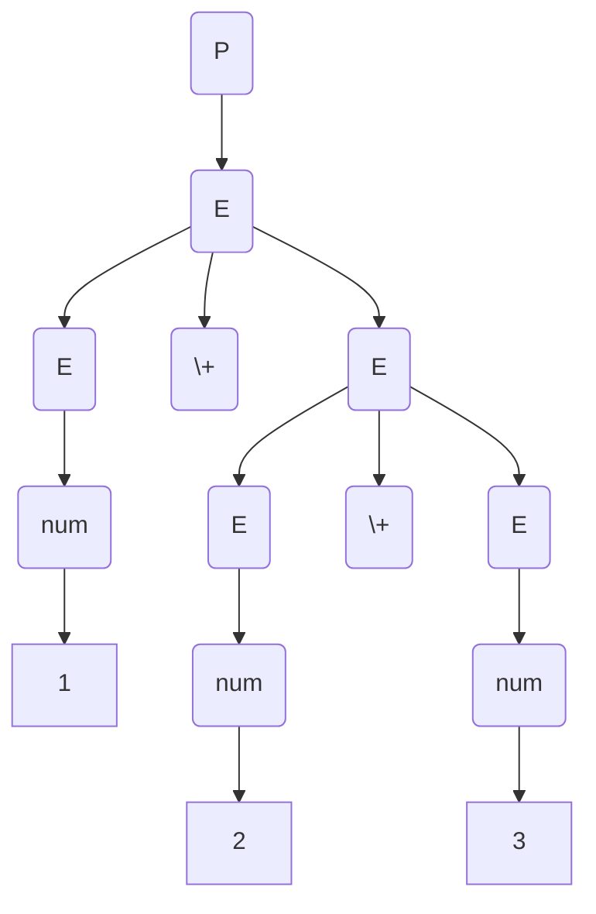
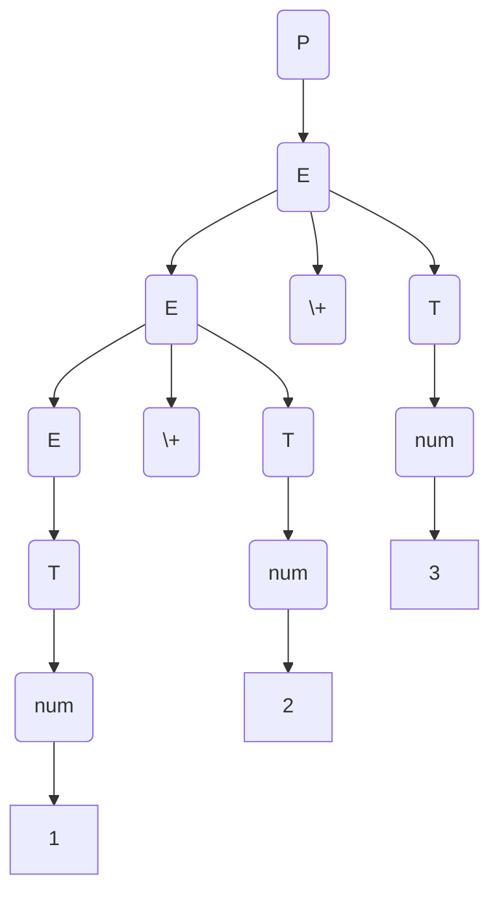

# Recursive Descent Calculator

A simple calculator that can be used to perform parenthesised, single-digit,
positive integer addition (for now), created using recursive descent parser to such arithmetic expressions.
The motivation behind this was to build a small project to test my Rust knowledge,
as I have been learning the language for some time now.


Recursive descent is an approach to writing a parser where there's a simple for function for each non-terminal in the grammar. The body of the function follows the right-hand sides of the corresponding rules: non-terminals result in a call to another parse function, while terminals result in considering the next token.

This definition is from the second edition of Introduction to Compilers and Language Design by Prof. Douglas Thain. (p.g 45) which I referenced while both doing the [original assignment](https://github.com/Mirror83/compiler-construction-assignments) which I did in C, and making this remake. I recommend it if you're interested in Compiler Construction, or would like more details on the concepts I gloss over here.

## Structure

The following are the files in `src/`

- [`tokenizer.rs`](src/tokenizer.rs) - Implements a hand-written tokenizer (not regex based) to retrieve tokens from user input
- [`parser.rs`](src/parser.rs) - Implements the recursive descent parser, which acts as an interpreter as well as it computes the
  value of the expression represented by the list of tokens it receives from the tokenizer.
- [`lib.rs`](src/lib.rs) - Calls the logic in the previous two files and implements logic for retrieving input from the user
  and showing output to them
- [`main.rs`](src/main.rs) - Prints the header, and calls the logic in `lib.rs`

## How to run

- Run tests and ensure they pass
  ```
  cargo test
  ```
- Run the project
  ```
  cargo run
  ```

## Tokens

The tokens that will be accepted include:

- Left bracket - $($
- Right bracket - $)$
- Integers (e.g. $1$, $13$) - $num$
- The addition operator - $+$

## Grammar

The grammar that the parser is implementing is as follows:

$$P \longrightarrow E$$
$$E \longrightarrow (E)$$
$$E \longrightarrow E + E$$
$$E \longrightarrow num$$

where the non-terminal symbols (denoted by capital letters) are:

- $P$ - refers to entire program to be parsed
- $E$ - refers to an expression in the program

and the terminal symbols are:

- $+$, $num$ and the bracket symbols as denoted in the tokens section above

However, a recursive descent parser cannot be implemented with the grammar as is.

First of all, the grammar is ambiguous meaning that one can have two or more different parse trees for the same input e.g. for 1 + 2 + 3, we can have:



or



As we are working with addition (a binary operator), we can remove the ambiguity by treating one of the operands as a constant term $T$ as follows:

$$P \longrightarrow E$$
$$E \longrightarrow E + T$$
$$E \longrightarrow T$$
$$T \longrightarrow (E)$$
$$T \longrightarrow num$$

This ensures that there's only one derivation (where we only expand the left-most non-terminal). For example, with the sum we had before i.e 1 + 2 + 3, we have:



Then we have to remove left recursion from the grammar in the rule: $E\longrightarrow E + T | T$

**N/B**: _Left recursion_ is a situation where we have a rule where the right-hand side starts with the symbol in the left-hand side.

If you have a rule of the following form:

$$ A \longrightarrow A \alpha_1 | A\alpha_2 | \dots | \beta_1 | \beta_2 |\dots$$

the left recursion can be removed by replacing it with the following sets of rules:

$$A \longrightarrow \beta_1 A\prime | \beta_2A\prime|\dots$$
$$A\prime \longrightarrow \alpha_1 A\prime |\alpha_2 A\prime | \dots |\epsilon$$

> Aside: The Markdown latex code `$\alpha_1$` is being rendered like this:
> $$\alpha_1$$,
> 
> with the 1 beside the alpha instead of it being at a lower baseline, so just keep in mind that it is supposed to be a subscript.

Applying this to our grammar (specifically the rule we identified above), the new grammar becomes:

$$P \longrightarrow E$$
$$E \longrightarrow T$$
$$E \longrightarrow TE\prime $$
$$E\prime \longrightarrow +TE\prime | \epsilon$$
$$T \longrightarrow (E)$$
$$T \longrightarrow num$$

The grammar is now suitable for recursive descent parsing (more formally, it is an LL(1) grammar).

## Next steps

These are some improvements that I may or may not get working on:

- Handle overflow
