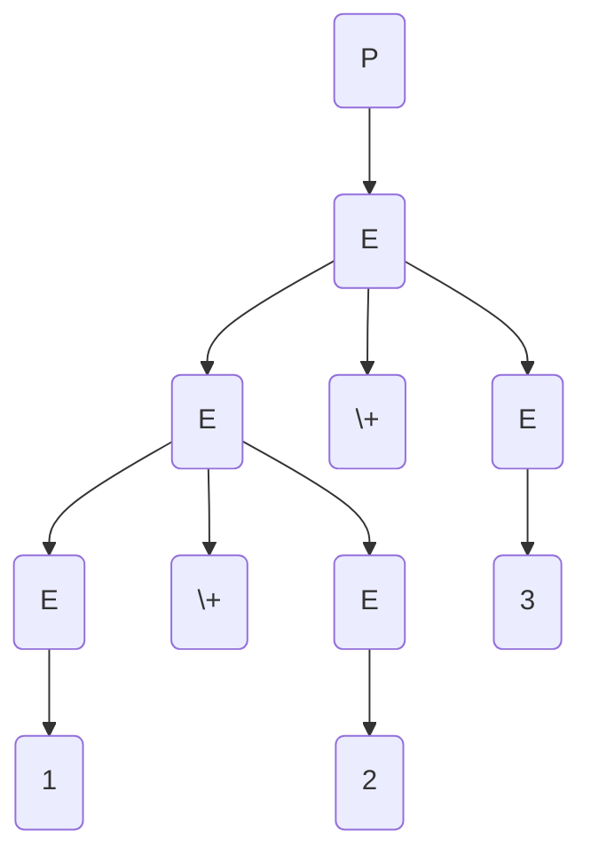
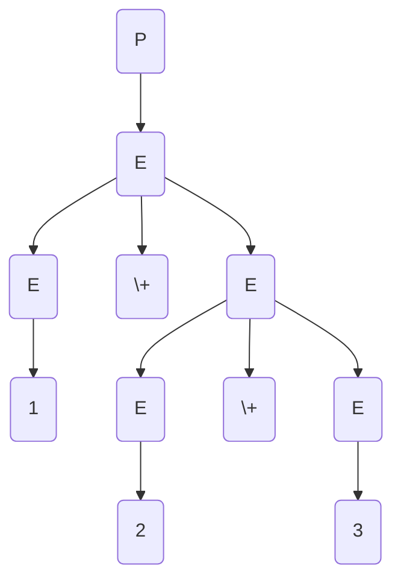
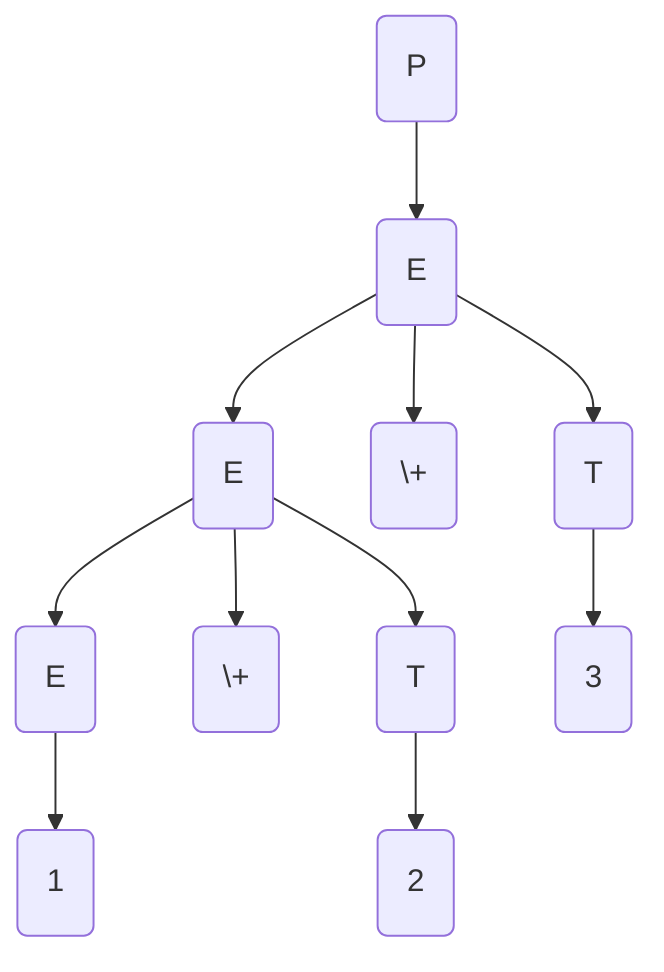

# Recursive Descent Calculator

A simple calculator that can be used to perform parenthesised positive integer addition (for now), created using recursive descent.

## Tokens

The tokens that will be accepted include:

- Left bracket - $($
- Right bracket - $)$
- Integers (e.g. $1$, $13$) - $num$
- The addition operator - $+$

## Grammar

The grammar that the parser is implementing is as follows:
$$P \longrightarrow E$$
$$E \longrightarrow (E)$$
$$E \longrightarrow E + E$$
$$E \longrightarrow num$$

where the non-terminal symbols (denoted by capital letters) are:

- $P$ - refers to entire program to be parsed
- $E$ - refers to an expression in the program

and the terminal symbols are:

- $+$, $num$ and the bracket symbols as denoted in the tokens section above

However, a recursive descent parser cannot be implemented with the grammar as is.

First of all, the grammar is ambiguous meaning that one can have two or more different parse trees for the same input e.g. for 1 + 2 + 3, we can have:

or

As we are working with addition (a binary operator), we can remove the ambiguity by treating one of the operands as a constant term $T$ as follows:
$$P \longrightarrow E$$
$$E \longrightarrow E + T$$
$$E \longrightarrow T$$
$$T \longrightarrow (E)$$
$$T \longrightarrow num$$

This ensures that there's only one derivation (where we only expand the left-most non-terminal). For example, with the sum we had before i.e 1 + 2 + 3, we have:

Then we have to remove left recursion from the grammar in the rule $E\longrightarrow E + T\space|\space T$

**N/B**: _Left recursion_ is a situation where we have a rule where the right-hand side starts with the symbol in the left-hand side.

If you have a rule of the following form:
$$ A \longrightarrow A\alpha_1|A\alpha_2|\dots|\beta_1|\beta_2|\dots$$
the left recursion can be removed by replacing it with the following sets of rules:
$$A \longrightarrow \beta_1A'|\beta_2A'|\dots$$
$$A' \longrightarrow \alpha_1A'|\alpha_2A'|\dots|\epsilon$$

Applying this to the rule we identified

Applying this to our grammar, the new grammar becomes:
$$P \longrightarrow E$$
$$E \longrightarrow T$$
$$E \longrightarrow TE'$$
$$E' \longrightarrow +TE' \space | \space \epsilon$$
$$T \longrightarrow (E)$$
$$T \longrightarrow num$$

The grammar is now suitable for recursive descent parsing (more formally, it is an LL(1) grammar).

For more details on the concepts skimmed over here, please consult the 2nd Edition of the book Introduction to Compiler Design by Prof. Douglas Thain.
